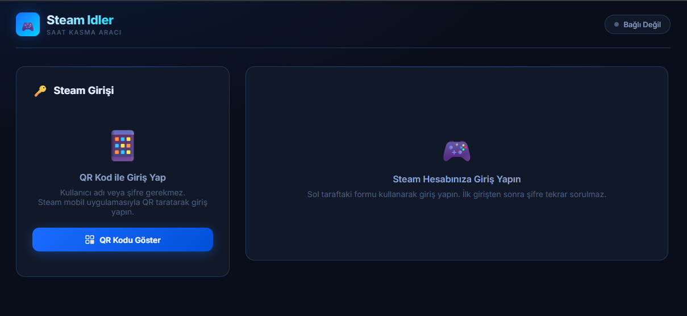
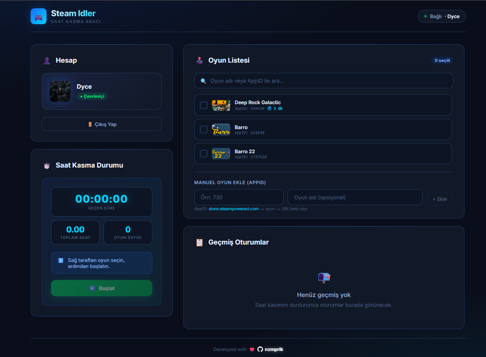

# Steam Idler

Steam Idler is an open-source desktop tool to idle Steam games and track session history locally.  
It supports secure QR login with Steam Mobile, saved sessions (optional), and multi-game idling with a modern UI.





---

## English

### Features

- QR login with Steam Mobile (`/api/login/qr`)
- Optional "Remember Me" session storage
- Multi-game idling support
- Session history (start/stop duration records)
- Built-in desktop app with Electron
- Turkish and English UI language options

### Tech Stack

- Frontend: React + Vite
- Backend: Node.js + Express
- Steam Integration: `steam-user`, `steam-session`, `steam-totp`
- Desktop Packaging: Electron + electron-builder

### Requirements

- Node.js 18+ (LTS recommended)
- npm

### Installation

```bash
npm install
```

### Run in Development

Run backend and frontend together:

```bash
npm run electron:dev
```

Or run separately:

```bash
npm run server
npm run dev
```

### Build Windows Installer

```bash
npm run dist:win
```

Output is created under `release/versions/<version>/`.

### Security Notes

- Tokens and local history are stored on the local machine.
- Sensitive local files are ignored by git:
  - `.steam_tokens.json`
  - `.idle_history.json`
  - `.settings.json` (if generated)
- `release/` artifacts are excluded from repository tracking.

### Project Scripts

- `npm run dev` -> Vite frontend dev server
- `npm run server` -> Node backend
- `npm run electron:dev` -> Desktop dev mode
- `npm run build` / `npm run build:ui` -> Production frontend build
- `npm run dist:win` -> Windows installer build
- `npm run lint` -> ESLint

---

## Turkce

### Ozellikler

- Steam Mobile ile QR giris (`/api/login/qr`)
- Istege bagli "Beni hatirla" oturum kaydi
- Coklu oyun idleme destegi
- Oturum gecmisi (baslat/durdur sure kayitlari)
- Electron ile masaustu uygulama
- Turkce ve Ingilizce arayuz secenegi

### Teknoloji Yigini

- On yuz: React + Vite
- Arka yuz: Node.js + Express
- Steam entegrasyonu: `steam-user`, `steam-session`, `steam-totp`
- Paketleme: Electron + electron-builder

### Gereksinimler

- Node.js 18+ (LTS onerilir)
- npm

### Kurulum

```bash
npm install
```

### Gelistirme Modunda Calistirma

Backend ve frontend'i birlikte calistirmak icin:

```bash
npm run electron:dev
```

Ayri ayri calistirmak icin:

```bash
npm run server
npm run dev
```

### Windows Kurulum Dosyasi Alma

```bash
npm run dist:win
```

Cikti dosyalari `release/versions/<versiyon>/` altinda olusur.

### Guvenlik Notlari

- Token ve gecmis verileri yerel bilgisayarda tutulur.
- Hassas yerel dosyalar git tarafinda ignore edilir:
  - `.steam_tokens.json`
  - `.idle_history.json`
  - `.settings.json` (olusursa)
- `release/` ciktilari repoya dahil edilmez.

### Scriptler

- `npm run dev` -> Vite on yuz gelistirme sunucusu
- `npm run server` -> Node backend
- `npm run electron:dev` -> Masaustu gelistirme modu
- `npm run build` / `npm run build:ui` -> Uretim on yuz build'i
- `npm run dist:win` -> Windows installer build'i
- `npm run lint` -> ESLint

---

## Contact

Developer: [nzmprlk](https://github.com/nazimparlak)
